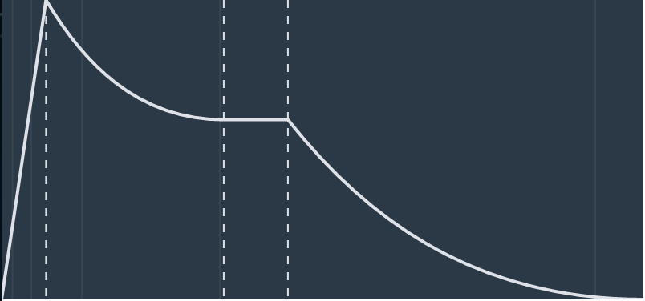

#React ADSR envelope graph
This React component renders a graph of an ADSR (Attack, Decay, Sustain and Release) envelope.

Mainly useful for synths using the Web Audio API.



##Example usage
```
import EnvelopeGraph from 'adsr-envelope-graph';

...

<EnvelopeGraph a={0.1} d={0.1} s={1} r={0.8} />
```

## Props
### Required
- a: Attack (s)
- d: Decay (s)
- s: Sustain (0-1)
- r: Release (s)

### Optional
- style: Style of the root element
- lineStyle: Style of the envelope line
- timeLineStyle: Style of the time markers
- phaseLineStyle: Style of the phase separator lines

